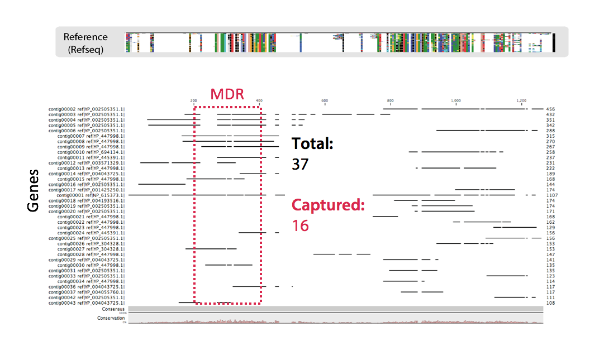
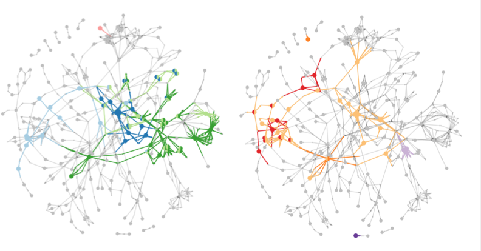

## Who am I

##### Wesley GOI, SCELSE PhD Student

* Interests:
    * Data Analytics
    * Travelling

 

--- .class #id 

## My research focus

###### Complex Microbial Communities of a Wastewater Treatment Plant

---

## What do I do

* Genomic and transcriptomic data analyses

--- &vertical

## What do I do

* Functional Analyses 
  * Metabolic Networks

---

## How I do this (Toolkit)

* R statistics,
* Python and Perl for scripting

---

## My lab

Peter Little (Main), Rohan Williams (CO)

